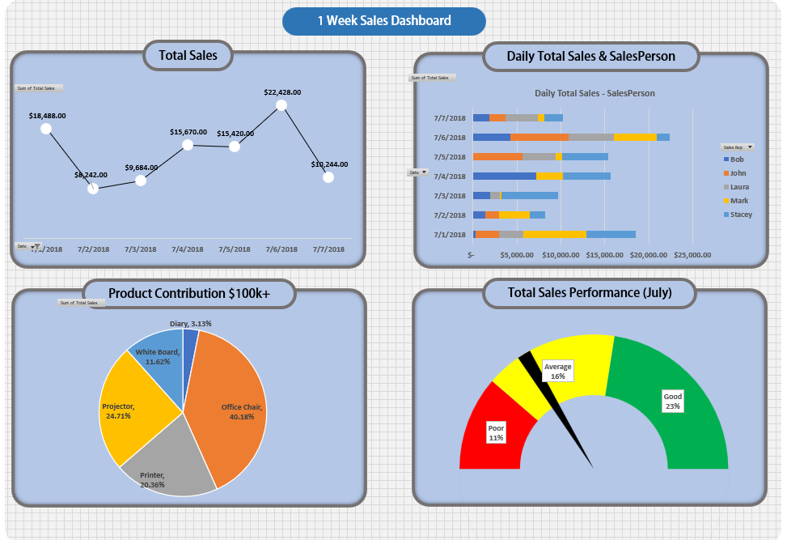

<h1> About Region-Wise-Sales-Dashboard Project</h1>

<h2>Project Overview;</h2>
Proyek ini adalah dasbor kinerja penjualan satu minggu yang dibangun di Excel, 
dirancang untuk memvisualisasikan dan menganalisis data penjualan dari 1–7 Juli 2018. 
Ini menunjukkan cara membuat dasbor profesional menggunakan alat pembuatan grafik, tabel pivot, dan pemformatan Excel, 
ideal untuk tim penjualan, analis bisnis, atau siapa pun yang ingin meningkatkan keterampilan visualisasi data mereka. 

<h2>Objective;</h2>
- Melacak tren penjualan harian selama periode 7 hari. 
- Membandingkan kinerja tenaga penjual antar hari. 
- Mengidentifikasi kontribusi berdasarkan produk terhadap total penjualan. 
- Meringkas kinerja mingguan menggunakan grafik pengukur (gauge chart). 
- Mengembangkan dasbor Excel yang bersih, interaktif, dan dapat digunakan kembali. 

<h2>Data Summary;</h2>=
Jenis Data: Transaksi penjualan harian (1 minggu). 
Periode: 1–7 Juli 2018. 
Dimensi: tanggal, produk, salesperson, total salesKuantitas, Harga, Komisi, Total Penjualan. 
Wilayah yang Dicakup: West, East, South, North 
Sumber: Open public dataset. 

<h2>Tools & Excel Features Used;</h2>
Excel Charting (Line Chart, Bar Chart, Pie Chart, Gauge Chart), 
Chart Formatting, 
Dashboard Layout & Design, 
Data Aggregation, 
Data Labeling & Formatting, 
Shape & Layout Composition, 

<h2>Dashboard Components;</h2>

1. Total Sales Trend (Line Chart)
- Visualizes daily total sales.
- Highlights peak and low sales days.

2. Daily Sales by Salesperson (Stacked Bar Chart)
- Breaks down daily sales by each sales rep (Bob, John, Laura, Mark, Stacey).

3. Product Contribution (Pie Chart)
- Office Chair (40.18%)
- Printer (20.36%)
- Projector (24.71%)
- White Board (11.62%)
- Diary (3.13%)

4. Weekly Performance Gauge
Uses a speedometer-style chart to rate weekly performance as Poor, Average, or Good. Based on predefined thresholds and actual total sales.

<h2>Key Insights;</h2>
- Highest Sales Day: July 6, 2018 (Total: $22,428) 
- Top Product: Office Chair (40.18% of total sales) 
- Top Sales Rep: Stacey (Total: $28,236) 
- Performance Rating: Good (based on gauge chart logic) 

<h2>File Structure;</h2>

- GaugeChart,
Berisi parameter pengukur dan ambang batas kinerja

- Dashboard,
Tampilan dasbor utama (saat ini kosong)

- PivotDashboard,
"Tabel pivot yang merangkum penjualan berdasarkan tanggal, tenaga penjual, dan produk"

- Dashboard_raw,
Data transaksi mentah untuk 1–7 Juli 2018

- "West, East, South, North",
Data penjualan regional untuk Juli 2018

<h2>Dislcaimer;</h2>
Dataset berasal dari sumber online gratis yang diperuntukkan untuk latihan analisis data. Dataset tersebut bersifat publik dan tidak mengandung informasi sensitif ataupun data operasional perusahaan. Sumber asli tidak tercatat, namun dataset telah dimodifikasi untuk keperluan pembelajaran serta pengembangan portofolio.
